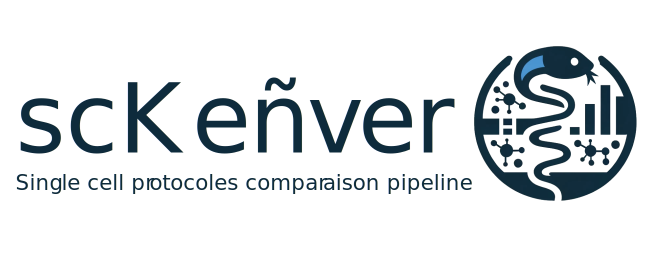

# scKeñver
scRNA‑seq Long‑Read Methods Benchmark



# Benchmarking single‑cell long‑read bioinformatics methods
[](https://www.docker.com/ "Go to Docker homepage")


# Introduction

scKenver (from the Breton word meaning *“comparison”* or *“report”*) provides a set of reproducible workflows for benchmarking single‑cell long‑read sequencing technologies. The goal of this project is to aggregate analyses comparing long‑ and short‑read single‑cell data in a transparent and automated manner, enabling others to replicate results and evaluate emerging long‑read platforms.

The repository contains three independent Nextflow pipelines that assess different aspects of long‑read performance:
- gene/UMI quantification
- UMI/transcript assignment
- isoform discovery

# Repository structure

```
scKenver/
├── README.md
├── LICENSE
├── 1-Comparaison_with_short_reads/
│   ├── main.nf
│   ├── nextflow.config
│   ├── samplesheet.csv
│   └── bin/
├── 2-UMI_transcript_assignment/
│   ├── main.nf
│   ├── nextflow.config
│   └── bin/
├── 3-Isoform_descovery/
│   ├── main.nf
│   ├── nextflow.config
│   ├── samplesheet.csv
│   └── bin/
└── test_data/
```

# Requirements

- **Nextflow ≥ 21.10.3**: Manages workflows and containers.
- **Docker or Singularity**: For containerized execution.

# Installation

```bash
git clone https://github.com/alihamraoui/scKenver.git
cd scKenver
```

# Pipeline 1: Expression and cell-type comparison

## Input
CSV file with columns: `shortReads`, `longReads`, `dataName`, `dataType`.

## Workflow

- MatrixProcessing
- CompareToShortReads
- VisualizeQC
- SingleCellMetrics (if single-cell)
- ScMetricsVisualisation
- SpatialMetrics (if spatial)

## Execution

```bash
cd 1-Comparaison_with_short_reads
nextflow run main.nf -profile docker
```

# Pipeline 2: UMI & Transcript Assignment

## Input

Configured in `nextflow.config`: `data_corrected`, `data_raw`, `size`.

## Workflow

- dataPrep
- transcriptMetrics
- UMIMetrics

## Execution

```bash
cd 2-UMI_transcript_assignment
nextflow run main.nf
```

# Pipeline 3: Isoform Discovery Evaluation

## Input

CSV with `gtf`, `tool` + `true_positives` GTF file.

## Workflow

- splitGtf
- gffcompare
- metricsVisualisation

## Execution

```bash
cd 3-Isoform_descovery
nextflow run main.nf
```

# Customisation

- Override `nextflow.config` parameters using `--param value`.
- Replace container with `-with-docker myimage`.
- Add HPC profiles (`slurm`, `sge`...) as needed.

# Outputs

- HTML reports
- PDF figures
- CSV summary tables
- `.rds` / `.Rdata` files

# License

MIT License

# Citation and acknowledgements

Developed by GenomiqueENS for benchmarking single-cell long-read methods.
