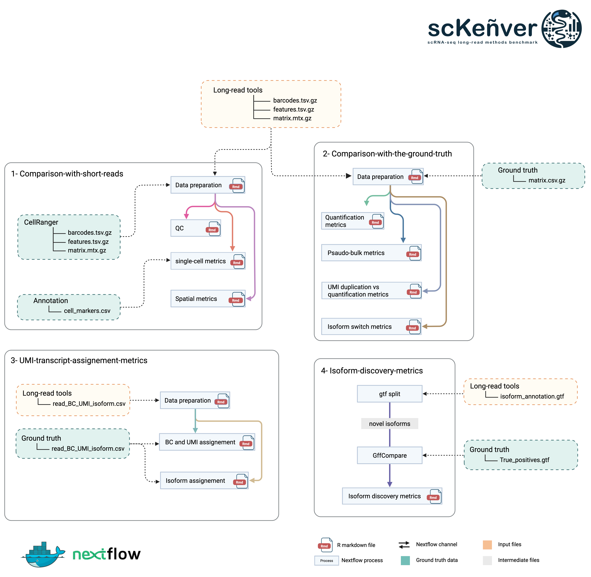

# scKeñver

<!---
scRNA‑seq Long‑Read Methods Benchmark

-->

## A systematic benchmark of scRNA-seq long-read bioinformatics methods
[](https://www.docker.com/ "Go to Docker homepage")





## 📌 Overview

**scKenver** is a comprehensive reproducible benchmarking framework for long-read single-cell and spatial transcriptomics.  
It provides **four independent and modular Nextflow workflows**:

1. **CompareToShortReads**  
   Benchmark gene-level quantification and cell metrics using Illumina as reference.

2. **UMI_transcript_assignment**  
   Evaluate UMI–transcript mapping quality and error-correction.

3. **Isoform_discovery**  
   Assess structural accuracy of isoform predictions from different tools.

4. **Comparison_with_ground_truth**  
   Compare results against a known *ground truth* (simulated or validated datasets).

Each workflow can run **individually** or **through a global orchestrator** (`main.nf` in repository root).

Repository structure:
```
scKenver/
├── main.nf                         # Global orchestrator
├── nextflow.config                 # Global configuration
├── 1-CompareToShortReads/
├── 2-UMI_transcript_assignment/
├── 3-Isoform_discovery/
├── 4-Comparison_with_ground_truth/
├── Matrix_samplesheet.csv          # input sheet for WF1
├── GTF_samplesheet.csv             # input sheet for WF3
└── bin/
```

---

## Test Data (Zenodo)

A complete, zipped test dataset is available on Zenodo:

- **DOI:** `10.5281/zenodo.16098020`

Example download:

```bash
wget -O scKenver_testdata.zip "https://zenodo.org/records/17432963/files/test_data.zip?download=1"
unzip scKenver_testdata.zip -d data_test
```

---

## ⚙️ Requirements

- **Nextflow ≥ 21.10.3**
- **Docker** (recommended) or **Singularity/Apptainer**
- Git

Setup:

```bash
git clone https://github.com/alihamraoui/scKenver.git
cd scKenver
nextflow -version
```
---

## ▶️ Run the Global Pipeline (all workflows)

The root `main.nf` orchestrates all workflows end-to-end.

```bash
nextflow run main.nf -profile docker   --outdir results_global   -with-report -with-trace -with-timeline
```

Outputs:

- `results_global/metrics/` — consolidated benchmark results  
- `results_global/figures/` — QC plots + benchmark visualizations  
- `execution report` — Nextflow logs, trace, timeline

---


## ▶️ Run Each Workflow Independently

---

### 1️⃣ WF1 — CompareToShortReads

**Purpose:** Compare gene/cell metrics between long-read and short-read datasets.

Steps:
- Matrix building & normalization
- Concordance of cell/gene metrics
- QC + visualization
- Spatial metrics if spatial data

Command:

```bash
cd 1-CompareToShortReads
nextflow run main.nf --samplesheet ../Matrix_samplesheet.csv   --outdir ../results_wf1
```

Outputs:
- correlation matrices, UMI/gene/cell recovery metrics
- QC reports

---

### 2️⃣ WF2 — UMI_transcript_assignment

**Purpose:** Evaluate UMI ↔ transcript assignment quality.

Command:

```bash
cd 2-UMI_transcript_assignment
nextflow run main.nf  --data_raw ../data_test/umi/raw   --data_corr ../data_test/umi/corrected   --size 100000   --outdir ../results_wf2
```

Outputs:
- UMI collision rates, duplication statistics
- Transcript-level QC

---

### 3️⃣ WF3 — Isoform_discovery

**Purpose:** Evaluate predicted isoforms against reference annotations (*truth*).

Command:

```bash
cd 3-Isoform_discovery
nextflow run main.nf --samplesheet ../GTF_samplesheet.csv   --reference_gtf ../data_test/refs/gencode.gtf   --outdir ../results_wf3
```

Outputs:
- Precision / recall / F1 per tool
- Structural error rates
- Visualization of isoform novelty types

---

### 4️⃣ WF4 — Comparison_with_ground_truth

**Purpose:** Comparison to a known ground truth dataset.

Command:

```bash
cd 4-Comparison_with_ground_truth
nextflow run main.nf --results_roots ../results_wf1,../results_wf3   --truth ../data_test/truth   --outdir ../results_wf4
```

Outputs:
- Gene & isoform benchmarking reports
- Clustering metrics (ARI, cLISI)
- Summary score tables

---

## 🧾 Input Samplesheets

### `Matrix_samplesheet.csv` (WF1)

| shortReads | longReads | dataName | dataType |
|-----------|-----------|----------|----------|
| /path/illumina | /path/nanopore | PBMC_1 | single-cell |

`dataType`: `single-cell` or `spatial`

---

### `GTF_samplesheet.csv` (WF3)

| gtf | tool | true_positives |
|-----|------|----------------|
| /path/bambu.gtf | bambu |
| /path/scisorseq.gtf | scisorseq |

---

## 🛠 Parameter Overview

### Global

| Parameter | Description |
|---|---|
| `--outdir` | Output directory |
| `-profile` | Execution profile (`docker`, `slurm`, ...) |
| `--max_cpus` | Thread limit |
| `--max_memory` | Memory per process |
| `--max_time` | Max runtime per task |

---

### Workflow-specific Parameters

**WF1**
| Parameter | Description |
|---|---|
| `--samplesheet` | Matrix_samplesheet.csv path |
| `--min_cells` | Cell filtering |
| `--min_genes` | Gene filtering |

**WF2**
| Parameter | Description |
|---|---|
| `--data_raw` | Raw UMI input |
| `--data_corr` | Corrected UMI input |
| `--size` | Subsampling size |

**WF3**
| Parameter | Description |
|---|---|
| `--reference_gtf` | Reference annotation |
| `--min_tpm` | Expression filter cutoff |

**WF4**
| Parameter | Description |
|---|---|
| `--results_roots` | Directories from WF1–WF3 |
| `--truth` | Ground truth folder |

---

## ✅ Reproducibility Best Practices

- Always run using **fixed Git tag releases** (e.g., `v1.0`)
- Track Nextflow execution reports for provenance

---

## 📚 Citation

If you use scKenver in your research, please cite:

> Hamraoui A. et al.  
> *A systematic benchmark of bioinformatics methods for single-cell and spatial RNA-seq Nanopore long-read data*  
> BioRxiv, 2025. DOI: To be added upon publication.

Zenodo DOI for test data:
> **10.5281/zenodo.16098020**

---

## 📬 Contact

For issues or suggestions:  
➡️ GitHub Issues: https://github.com/alihamraoui/scKenver/issues
